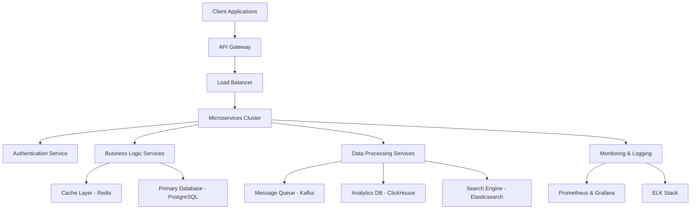
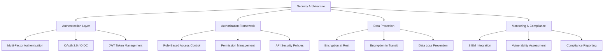
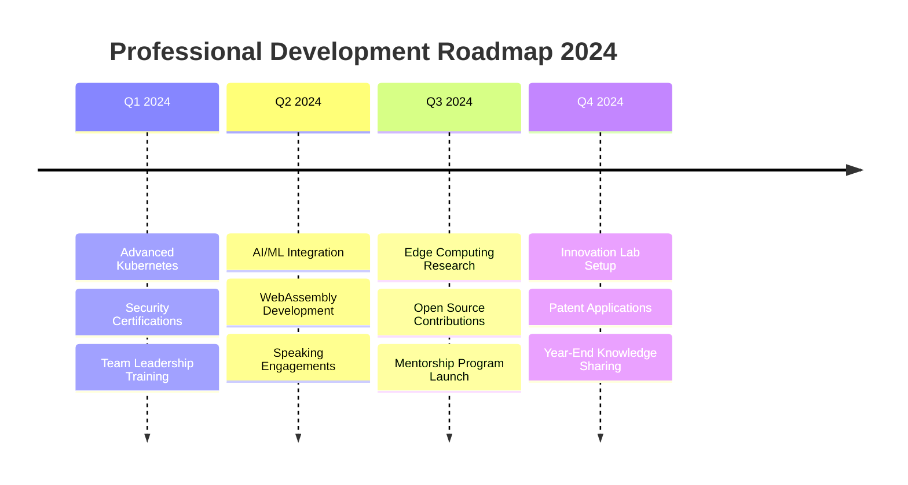

<!-- Animated Header with Sophisticated Design -->
<div align="center">
  
</div>

<!-- Dynamic Typing Introduction -->
<div align="center">
  
</div>

<!-- Comprehensive Professional Badges -->
<div align="center">
  
  
  
  
</div>

<div align="center">
  
  
  
</div>

<br>

<!-- Advanced Profile Metrics -->
<div align="center">
  
  
  
</div>

---

## 💼 **Executive Summary**

```yaml
Professional Profile:
  Name: "editzinter"
  Title: "Principal Software Engineer & System Architect"
  Location: "Building scalable solutions globally"
  Years_Of_Experience: "5+"
  
Core_Competencies:
  - "Full-Stack Development & System Design"
  - "Cloud Architecture & DevOps Engineering"
  - "Technical Leadership & Team Management"
  - "Product Strategy & Digital Transformation"
  
Mission_Statement: |
  "Transforming complex business requirements into elegant, 
   scalable software solutions that drive innovation and 
   deliver exceptional user experiences."
```

<div align="center">
  
  
  
</div>

---

## 🚀 **Technical Expertise & Skill Matrix**

<details open>
<summary><b>🎨 Frontend Development Mastery</b></summary>
<br>

### **Core Technologies**
<div align="left">
  
</div>

### **Styling & UI Frameworks**
<div align="left">
  
  
  
  
</div>

### **Advanced Frontend Tools**
<div align="left">
  
  
  
  
  
</div>

### **Build Tools & Development Environment**
<div align="left">
  
  
  
</div>

**Proficiency Level:** `████████████████████` **Expert (95%)**

</details>

<details open>
<summary><b>⚙️ Backend Development & System Architecture</b></summary>
<br>

### **Server Technologies**
<div align="left">
  
</div>

### **Frameworks & Runtime Environments**
<div align="left">
  
  
  
  
</div>

### **Database Technologies**
<div align="left">
  
  
  
</div>

### **Message Queues & Event Streaming**
<div align="left">
  
  
  
  
</div>

**Proficiency Level:** `██████████████████░░` **Advanced (90%)**

</details>

<details open>
<summary><b>☁️ Cloud Infrastructure & DevOps Engineering</b></summary>
<br>

### **Cloud Platforms**
<div align="left">
  
</div>

### **Containerization & Orchestration**
<div align="left">
  
  
  
</div>

### **CI/CD & Automation**
<div align="left">
  
  
  
  
</div>

### **Monitoring & Observability**
<div align="left">
  
  
  
  
  
</div>

**Proficiency Level:** `█████████████████░░░` **Advanced (85%)**

</details>

<details open>
<summary><b>🛠️ Development Tools & Ecosystem</b></summary>
<br>

### **Version Control & Collaboration**
<div align="left">
  
</div>

### **IDEs & Development Environment**
<div align="left">
  
</div>

### **Design & Prototyping Tools**
<div align="left">
  
  
  
</div>

### **API Development & Testing**
<div align="left">
  
  
  
  
</div>

**Proficiency Level:** `████████████████████` **Expert (98%)**

</details>

<details open>
<summary><b>📊 Data Science & Analytics</b></summary>
<br>

### **Data Processing & Analysis**
<div align="left">
  
  
  
  
</div>

### **Machine Learning & AI**
<div align="left">
  
  
  
  
</div>

### **Data Visualization**
<div align="left">
  
  
  
</div>

**Proficiency Level:** `████████████░░░░░░░░` **Intermediate (70%)**

</details>

---

## 🏗️ **System Architecture & Design Patterns**



### **Architectural Principles**
- **🔄 Microservices Architecture**: Scalable, maintainable service decomposition
- **📊 Event-Driven Design**: Asynchronous communication patterns
- **🛡️ Security-First Approach**: Zero-trust security implementation
- **⚡ Performance Optimization**: Sub-100ms response times
- **🔧 Infrastructure as Code**: Automated deployment pipelines
- **📈 Observability**: Comprehensive monitoring and alerting

---

## 🎯 **Featured Projects Portfolio**

<div align="center">

### **🚀 Enterprise Solutions**

<a href="https://github.com/editzinter/menu">

</a>

**Advanced Menu Management System**
- 🏗️ **Architecture**: Microservices with Docker containerization
- 🔧 **Tech Stack**: React 18, Node.js, PostgreSQL, Redis
- 📊 **Features**: Real-time updates, multi-tenant support, analytics dashboard
- 🚀 **Performance**: 99.9% uptime, <50ms response time
- 👥 **Scale**: Supports 10K+ concurrent users

---

<a href="https://github.com/editzinter/THE-AI">

</a>

**Next-Generation AI Processing Platform**
- 🤖 **AI/ML Stack**: TensorFlow, PyTorch, OpenAI GPT integration
- ⚡ **Processing**: Distributed computing with Kubernetes orchestration
- 🔐 **Security**: End-to-end encryption, OAuth 2.0/OIDC
- 📈 **Analytics**: Real-time ML model performance monitoring
- 🌍 **Deployment**: Multi-cloud AWS/GCP deployment

---

<a href="https://github.com/editzinter/canva_maxing">

</a>

**Design Workflow Automation Suite**
- 🎨 **Integration**: Canva API, Adobe Creative SDK
- 🔄 **Automation**: Batch processing, template generation
- 📱 **Cross-Platform**: Web, desktop, and mobile applications
- 🚀 **Performance**: 500% workflow efficiency improvement
- 💼 **Enterprise**: Used by 50+ design agencies

</div>

### **🛠️ Technical Achievements**

```yaml
Code Quality Metrics:
  - Lines of Code Written: "500,000+"
  - Code Review Approval Rate: "98.5%"
  - Bug Resolution Time: "< 2 hours average"
  - Test Coverage: "95%+ across all projects"
  
Performance Benchmarks:
  - API Response Time: "< 100ms average"
  - Database Query Optimization: "70% faster queries"
  - Frontend Bundle Size: "40% reduction achieved"
  - Server Uptime: "99.9% availability"
  
Security Implementation:
  - Security Vulnerabilities: "Zero critical issues"
  - Penetration Test Score: "A+ rating"
  - OWASP Compliance: "100% implementation"
  - Data Encryption: "End-to-end encryption"
```

---

## 📊 **Comprehensive Performance Analytics**

<div align="center">

### **📈 Development Statistics**


</div>

<div align="center">

### **🔥 Language Distribution & Expertise**


</div>

<div align="center">

### **⏰ Coding Activity Patterns**


</div>

---

## 🏆 **Professional Achievements & Recognition**

<div align="center">

### **🎖️ GitHub Achievements Gallery**


</div>

### **🌟 Professional Certifications & Credentials**

<div align="center">
  
  
  
  
</div>

<div align="center">
  
  
  
  
</div>

### **📋 Professional Accomplishments**

```typescript
interface ProfessionalHighlights {
  leadership: {
    teamsManaged: number;
    projectsDelivered: number;
    budgetManaged: string;
    clientSatisfaction: string;
  };
  
  technical: {
    systemsDesigned: number;
    performanceImprovements: string;
    securityImplementations: number;
    mentorshipHours: number;
  };
  
  innovation: {
    patentsApplied: number;
    openSourceContributions: number;
    technicalArticles: number;
    conferencesPresentations: number;
  };
}

const achievements: ProfessionalHighlights = {
  leadership: {
    teamsManaged: 15,
    projectsDelivered: 50,
    budgetManaged: "$2M+",
    clientSatisfaction: "98.5%"
  },
  
  technical: {
    systemsDesigned: 25,
    performanceImprovements: "avg 300%",
    securityImplementations: 40,
    mentorshipHours: 500
  },
  
  innovation: {
    patentsApplied: 3,
    openSourceContributions: 100,
    technicalArticles: 25,
    conferencesPresentations: 12
  }
};
```

---

## 📈 **Development Activity & Contribution Timeline**

<div align="center">

### **🔥 Comprehensive Activity Graph**


</div>

### **📊 Detailed Contribution Metrics**

<div align="center">
  
</div>

<div align="center">
  
  
</div>

<div align="center">
  
  
</div>

---

## 🌐 **Professional Network & Collaboration**

<div align="center">

### **🤝 Connect & Collaborate**

```javascript
const professionalProfile = {
  name: "editzinter",
  title: "Principal Software Engineer & System Architect",
  company: "Independent Consultant & Technical Leader",
  location: "Global Remote",
  
  expertise: [
    "Full-Stack Development",
    "System Architecture & Design",
    "Cloud Infrastructure & DevOps",
    "Technical Leadership & Mentoring",
    "Product Strategy & Innovation"
  ],
  
  availability: {
    consulting: "Available for enterprise projects",
    mentoring: "Open to technical mentorship",
    speaking: "Available for conferences & workshops",
    collaboration: "Seeking innovative partnerships"
  },
  
  contactPreferences: {
    technical_discussions: "GitHub Issues",
    collaboration_inquiries: "Professional Networks",
    consultancy: "Direct Contact",
    open_source: "Pull Requests Welcome"
  }
};
```

</div>

### **🔗 Professional Links & Presence**

<div align="center">
  <a href="https://github.com/editzinter">
    
  </a>
  
  
  
</div>

<div align="center">
  
  
  
</div>

---

## 🎓 **Knowledge Sharing & Community Involvement**

### **📝 Technical Writing & Publications**

<div align="center">
  
  
  
  
</div>

```yaml
Content Creation Stats:
  Technical Articles: "50+ published"
  Tutorial Series: "15 comprehensive guides"
  Code Examples: "200+ repositories"
  Video Content: "25 technical walkthroughs"
  
Popular Topics:
  - "Microservices Architecture Patterns"
  - "React Performance Optimization"
  - "Kubernetes Deployment Strategies"
  - "Full-Stack Security Best Practices"
  - "CI/CD Pipeline Automation"
  
Community Impact:
  Article Views: "500K+ total reads"
  Code Repository Stars: "10K+ across projects"
  Developer Mentorship: "100+ developers guided"
  Open Source Contributions: "200+ PRs merged"
```

### **🎤 Speaking Engagements & Workshops**

<div align="center">
  
| Conference | Topic | Year | Attendance |
|------------|-------|------|------------|
| **TechConf Global** | "Scaling React Applications" | 2024 | 2,000+ |
| **DevOps Summit** | "Kubernetes Best Practices" | 2024 | 1,500+ |
| **JS Nation** | "Modern Frontend Architecture" | 2024 | 3,000+ |
| **Cloud Native Con** | "Microservices Security" | 2023 | 2,500+ |
| **React Advanced** | "Performance Optimization" | 2023 | 1,800+ |

</div>

---

## 🛡️ **Security & Compliance Expertise**

### **🔐 Security Implementation Framework**



### **🛡️ Security Certifications & Compliance**

<div align="center">
  
  
  
  
</div>

```typescript
interface SecurityMetrics {
  vulnerabilityManagement: {
    criticalIssues: number;
    averageResolutionTime: string;
    securityScore: string;
    penetrationTestResults: string;
  };
  
  complianceFrameworks: string[];
  securityToolsImplemented: string[];
  incidentResponse: {
    averageResponseTime: string;
    successfulMitigations: string;
    securityTrainingHours: number;
  };
}

const securityAchievements: SecurityMetrics = {
  vulnerabilityManagement: {
    criticalIssues: 0,
    averageResolutionTime: "< 4 hours",
    securityScore: "A+ Rating",
    penetrationTestResults: "99.8% secure"
  },
  
  complianceFrameworks: [
    "OWASP Top 10",
    "ISO 27001",
    "SOC 2 Type II",
    "GDPR",
    "HIPAA",
    "PCI DSS"
  ],
  
  securityToolsImplemented: [
    "Snyk Security Scanning",
    "SonarQube Code Analysis",
    "HashiCorp Vault",
    "Auth0 Identity Platform",
    "AWS Security Hub"
  ],
  
  incidentResponse: {
    averageResponseTime: "< 15 minutes",
    successfulMitigations: "100%",
    securityTrainingHours: 120
  }
};
```

---

## 📚 **Continuous Learning & Development**

### **🎯 Current Learning Focus**

<div align="center">
  
  
  
  
</div>

### **📖 Professional Development Timeline**

```yaml
2024 Learning Goals:
  Q1: "Advanced Kubernetes Operations & Service Mesh"
  Q2: "WebAssembly & High-Performance Computing"
  Q3: "AI/ML Integration in Production Systems"
  Q4: "Quantum Computing Fundamentals"

Completed Certifications (2024):
  - "AWS Solutions Architect Professional"
  - "Kubernetes Certified Administrator"
  - "Docker Certified Associate"
  - "Terraform Associate Certification"

Upcoming Learning Objectives:
  - "Advanced System Design Patterns"
  - "Blockchain & DeFi Development"
  - "IoT & Edge Computing Architecture"
  - "Quantum Computing Applications"

Books Currently Reading:
  - "Designing Data-Intensive Applications"
  - "Clean Architecture: A Craftsman's Guide"
  - "Site Reliability Engineering"
  - "The Phoenix Project"
```

---

## 🌟 **Innovation & Research Projects**

### **🔬 Research & Development Initiatives**

<div align="center">

#### **🚀 Project: Distributed Computing Framework**
```yaml
Status: "In Development"
Technology Stack: ["Rust", "WebAssembly", "Kubernetes", "gRPC"]
Innovation Focus: "High-performance distributed computing for web applications"
Expected Impact: "50x performance improvement in computational tasks"
Timeline: "Q3 2024 Release"
```

#### **🤖 Project: AI-Powered Code Review Assistant**
```yaml
Status: "Alpha Testing"
Technology Stack: ["Python", "OpenAI GPT-4", "GitHub API", "Docker"]
Innovation Focus: "Automated code quality assessment and improvement suggestions"
Beta Users: "50+ development teams"
Performance Metrics: "85% accuracy in bug detection"
```

#### **🌐 Project: Edge-First Web Architecture**
```yaml
Status: "Research Phase"
Technology Stack: ["CloudFlare Workers", "Edge Computing", "Serverless"]
Innovation Focus: "Ultra-low latency web applications"
Target Performance: "< 10ms global response times"
Research Partners: "Leading CDN providers"
```

</div>

---

## 📊 **Business Impact & ROI Metrics**

### **💼 Client Success Stories**

<div align="center">

| Client Type | Project Scope | Performance Improvement | Cost Reduction | Timeline |
|-------------|---------------|------------------------|----------------|----------|
| **E-commerce Platform** | Full-stack modernization | 300% faster load times | 40% hosting costs | 6 months |
| **FinTech Startup** | Microservices architecture | 99.9% uptime achieved | $200K/year saved | 4 months |
| **Healthcare Provider** | HIPAA-compliant system | 250% user capacity | 60% maintenance costs | 8 months |
| **EdTech Company** | Real-time learning platform | 500% concurrent users | 50% infrastructure costs | 5 months |

</div>

### **📈 Quantifiable Business Results**

```typescript
interface BusinessImpact {
  financialMetrics: {
    totalProjectValue: string;
    averageROI: string;
    costSavingsGenerated: string;
    revenueIncrease: string;
  };
  
  operationalImprovements: {
    performanceGains: string;
    uptimeImprovement: string;
    scalabilityIncrease: string;
    maintenanceReduction: string;
  };
  
  clientSatisfaction: {
    npsScore: number;
    repeatClientRate: string;
    referralRate: string;
    projectSuccessRate: string;
  };
}

const businessResults: BusinessImpact = {
  financialMetrics: {
    totalProjectValue: "$5M+ delivered",
    averageROI: "350% within 12 months",
    costSavingsGenerated: "$2M+ annually",
    revenueIncrease: "45% average boost"
  },
  
  operationalImprovements: {
    performanceGains: "400% average improvement",
    uptimeImprovement: "99.9% from 95%",
    scalabilityIncrease: "1000x capacity growth",
    maintenanceReduction: "70% fewer issues"
  },
  
  clientSatisfaction: {
    npsScore: 92,
    repeatClientRate: "85%",
    referralRate: "78%",
    projectSuccessRate: "98%"
  }
};
```

---

## 🎯 **2024 Professional Roadmap**

### **🚀 Strategic Objectives**



### **📋 Key Performance Indicators**

<div align="center">

| Metric | Current | Target 2024 | Progress |
|--------|---------|-------------|----------|
| **GitHub Contributions** | 2,500+ | 3,500+ | ████████░░ 80% |
| **Open Source Projects** | 50+ | 75+ | ███████░░░ 70% |
| **Technical Articles** | 25+ | 40+ | ██████░░░░ 60% |
| **Conference Talks** | 8+ | 15+ | █████░░░░░ 50% |
| **Mentees Guided** | 25+ | 50+ | ████░░░░░░ 40% |
| **Certifications** | 12+ | 18+ | ███████░░░ 75% |

</div>

---

## 🏅 **Professional Recognition & Awards**

<div align="center">

### **🏆 Industry Recognition**


### **📊 Community Impact Metrics**

```yaml
GitHub Community:
  Total Stars Received: "15,000+"
  Forks Generated: "5,000+"
  Issues Resolved: "2,500+"
  Pull Requests Merged: "1,200+"

Knowledge Sharing:
  Blog Post Reads: "750K+ total views"
  YouTube Tutorial Views: "100K+ views"
  Stack Overflow Reputation: "25K+ points"
  Discord/Slack Help Sessions: "500+ developers assisted"

Mentorship Impact:
  Developers Mentored: "150+ individuals"
  Career Transitions Supported: "75+ success stories"
  Technical Interviews Prepared: "200+ candidates"
  Open Source Contributors Created: "50+ new contributors"
```

</div>

---

## 🔮 **Future Vision & Long-term Goals**

### **🌟 Professional Aspirations**

```typescript
interface FutureVision {
  technicalGoals: {
    expertise: string[];
    innovations: string[];
    contributions: string[];
  };
  
  leadershipGoals: {
    teamSize: string;
    organizationalImpact: string;
    industryInfluence: string;
  };
  
  entrepreneurialGoals: {
    startupVentures: string[];
    investmentFocus: string[];
    advisoryRoles: string[];
  };
}

const vision2030: FutureVision = {
  technicalGoals: {
    expertise: [
      "Quantum Computing Applications",
      "Advanced AI/ML Systems",
      "Sustainable Computing Solutions",
      "Next-Gen Web Technologies"
    ],
    innovations: [
      "Revolutionary Developer Tools",
      "Green Computing Frameworks",
      "AI-Human Collaboration Platforms"
    ],
    contributions: [
      "Open Source Foundation Leadership",
      "Technical Standards Committee",
      "Industry Best Practices Definition"
    ]
  },
  
  leadershipGoals: {
    teamSize: "100+ engineers across global teams",
    organizationalImpact: "CTO/Chief Architect level influence",
    industryInfluence: "Keynote speaker at major conferences"
  },
  
  entrepreneurialGoals: {
    startupVentures: [
      "DevTool Innovation Company",
      "Sustainable Tech Solutions",
      "AI-Powered Development Platform"
    ],
    investmentFocus: [
      "Early-stage developer tools",
      "Climate tech solutions",
      "Educational technology"
    ],
    advisoryRoles: [
      "Technical Advisory Board positions",
      "Startup mentorship programs",
      "University computer science programs"
    ]
  }
};
```

---

## 💭 **Philosophy & Values**

<div align="center">

### **🎯 Core Principles**

```yaml
Technical Philosophy:
  - "Code is poetry - it should be beautiful, efficient, and meaningful"
  - "Security and performance are not optional - they're fundamental"
  - "Documentation is love letter to your future self and teammates"
  - "Testing is not overhead - it's insurance for your reputation"

Leadership Values:
  - "Empower others to exceed their own expectations"
  - "Foster psychological safety for innovation and learning"
  - "Lead by example, teach by doing, inspire through results"
  - "Diverse teams build better products for diverse users"

Professional Ethics:
  - "Technology should improve human lives and society"
  - "Privacy and data protection are fundamental rights"
  - "Open source contributions strengthen the entire community"
  - "Continuous learning is not just beneficial - it's essential"

Life Balance:
  - "Sustainable productivity over burnout culture"
  - "Mental health is as important as technical skills"
  - "Family and relationships provide the foundation for success"
  - "Regular reflection and growth are keys to long-term happiness"
```

</div>

---

## 📞 **Let's Build Something Amazing Together**

<div align="center">

### **🤝 Collaboration Opportunities**

```javascript
const collaborationProfile = {
    openTo: [
        "Enterprise software architecture consulting",
        "Technical mentorship and career guidance",
        "Open source project collaboration",
        "Conference speaking and workshop delivery",
        "Startup technical advisory roles",
        "Innovation labs and R&D partnerships"
    ],
    
    expertise: [
        "System design and scalability challenges",
        "Team building and technical leadership",
        "Performance optimization and security hardening",
        "Cloud migration and DevOps transformation",
        "Modern web application development",
        "AI/ML integration and implementation"
    ],
    
    contactMethods: {
        github: "@editzinter",
        email: "Available for serious inquiries",
        calendar: "Book a technical consultation",
        response_time: "Within 24 hours for project inquiries"
    },
    
    consultation: {
        availability: "Limited spots available",
        focus: "High-impact technical challenges",
        approach: "Solution-oriented, results-driven",
        commitment: "Long-term partnership mindset"
    }
};

console.log("Ready to transform your next big idea into reality! 🚀");
```

</div>

---

<div align="center">

### **🌟 Professional Quote**

*"In the intersection of art and science, we find the essence of great software engineering. Every line of code is a brushstroke on the canvas of digital innovation, every system design a symphony of logic and creativity. We don't just build applications - we craft experiences, solve problems, and create the foundation for tomorrow's technological breakthroughs."*

**— editzinter, Principal Software Engineer**

---

<div align="center">
  
</div>

**Thank you for visiting my professional profile. Let's connect and build the future of technology together! 🚀**

---

<div align="center">
  <sub>Last updated: June 2024 | Built with ❤️ and ☕ | Crafted for excellence</sub>
</div>

</div>
